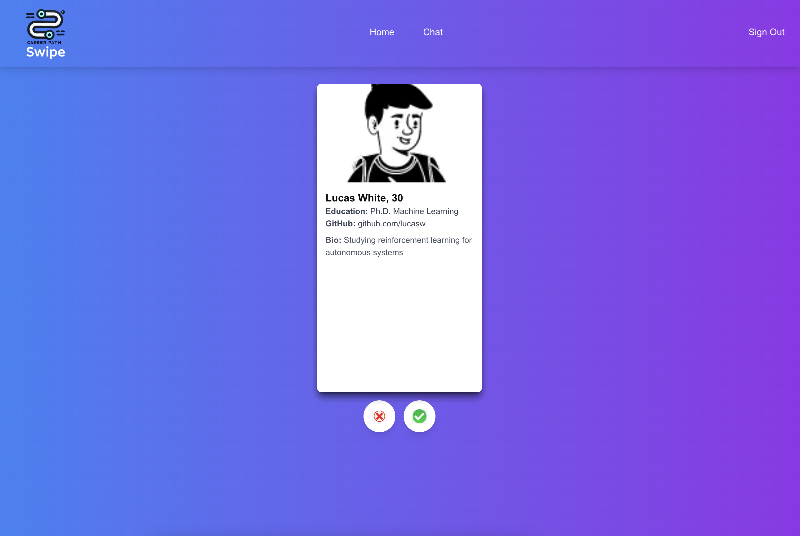
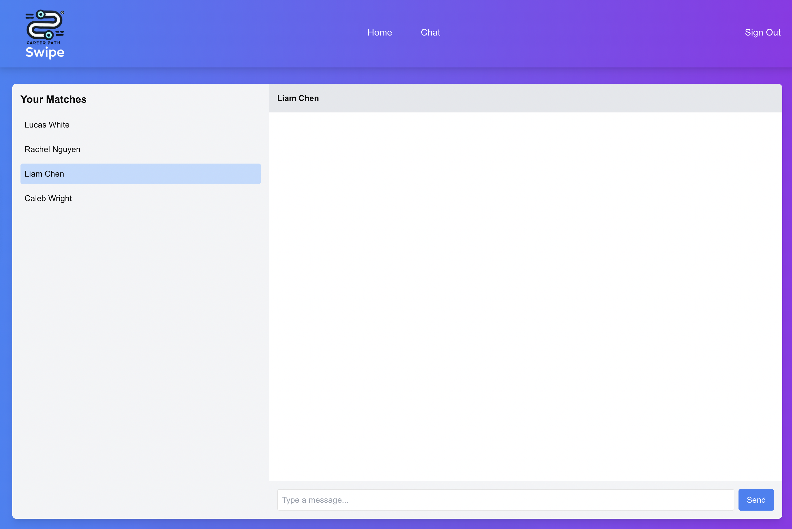

# Swipe: AI-Driven Professional Networking App

Swipe is a professional networking app designed to connect individuals based on their research, job focus, and interests. Using AI-powered APIs, it intelligently matches users by analyzing their bios and relevant information to foster meaningful collaborations in a Tinder-like interface.

## Features
- **AI-Driven Matching**: The app uses AI APIs to analyze bios and match users based on common research interests or professional focuses.
- **Simple and Intuitive UI**: With a minimalistic design, users can easily swipe left or right to connect with professionals who share their passions.
- **Real-Time Messaging**: Once matched, users can chat in real-time, making networking seamless and immediate.

## Inspiration
The project was inspired by the need for a more efficient, user-friendly platform to connect professionals and researchers. We realized that existing platforms were either too broad or lacked smart matching features, which led us to develop Swipe as a solution.

## How It Works
1. **Sign Up**: Users register and provide information about their education, GitHub (optional), and bio.
2. **AI-Powered Matching**: The AI API processes this information and presents users with profiles that align with their research focus or career interests.
3. **Connect**: Swipe right to connect with someone who interests you or left to pass.
4. **Chat**: Once matched, users can begin chatting directly through the platform.

## Screenshots

### Home Screen - Swipe Interface


### Chat Screen - Matched Connections


## Technologies Used
- **React** for the front-end to build a responsive and intuitive user interface.
- **Node.js & MongoDB** for the back-end to manage user data and handle server requests.
- **AI APIs** to intelligently match users based on their bios.
  
## Challenges
- Integrating the AI APIs and ensuring fast, accurate matches was a key challenge.
- Building a real-time chat feature while ensuring scalability and security for user data.
  
## Accomplishments
- Successfully implemented AI-driven bio matching.
- Built a fully functional front-end with seamless swiping and chat functionalities.

## What's Next
- We plan to refine the AI matching algorithms for more precise connections.
- Adding additional filters such as location or industry to help users find the most relevant connections.
- Expanding the app to include group networking events and team matching.

## How to Run Locally
1. Clone the repo:  
   ```bash
   git clone https://github.com/your-username/swipe.git
   cd swipe
   ```
2. Install dependencies:  
   ```bash
   npm install
   ```
3. Run the app:  
   ```bash
   npm start
   ```
